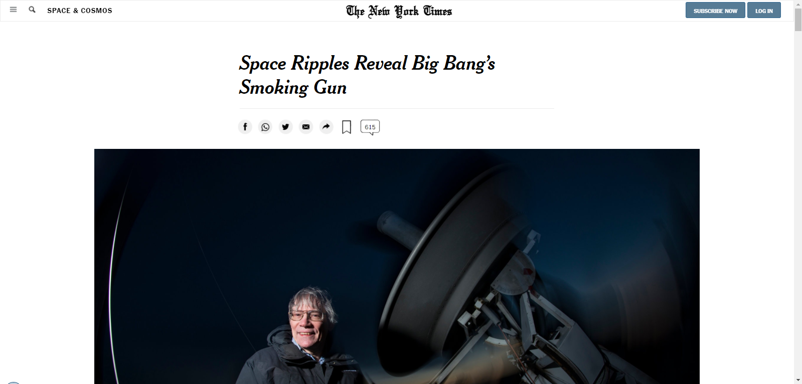

# New York Times Article Project

> This project is created with the objective of trying to copy an article from The New York Times
> Grid CSS and flexbox were used to place the elements in the HTML of the project



Contains a non responsive interface but very similar to the original one.

## Built With

- HTML & CSS

## Live Demo

[Live Demo Link](https://marcosmerida.github.io/New-York-Times-article-Project/)

## Instalation

1. Clone the repo
   ```sh
   git clone https://github.com/marcosmerida/New-York-Times-article-Project.git
   ```
2. Make sure that the images inside the /images file are linked in the index.html

3. Link the files style.css, grid.css and footer.css into the HTML file.

## Authors

👤 **Juan Marcos Mérida**

- GitHub: [@githubhandle](https://github.com/marcosmerida)
- Twitter: [@twitterhandle](https://twitter.com/c05mar)
- LinkedIn: [LinkedIn](https://linkedin.com/in/marcos-merida-219437206/)

## Show your support

Give a ⭐️ if you like this project!

